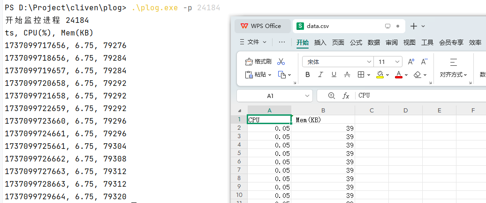

# Process Logger 进程监测工具

[](https://github.com/Trisia/plog/actions/workflows/go.yml)
[](https://github.com/Trisia/plog/releases)

用于监测进程运行时的资源消耗情况，包括 CPU、内存用于分析程序稳定性。



下载工具： [版本发布 Release https://github.com/Trisia/plog/releases](https://github.com/Trisia/plog/releases)

使用方法：

```bash
plog -p <pid> -o <output> -t <interval>
```

参数如下：

```
Usage plog:

  plog -p 745 -o ./data.csv

  -i int
        采样间隔，单位毫秒 (default 1000)
  -o string
        数据存储位置 (default "./data.csv")
  -p int
        进程ID
  -v    版本信息 1.0.0
```


使用示例

```bash
./plog -p 5751 -o /tmp/plog.log 
```

监测结果会同时打印到控制台和输出到文件，文件格式如下：

```csv
CPU(%), Mem(KB)
0.00, 6072
0.00, 6072
0.00, 6072
0.00, 6072
0.00, 6072
```
